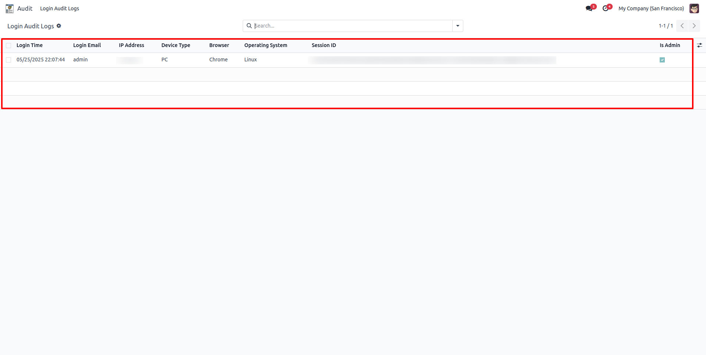
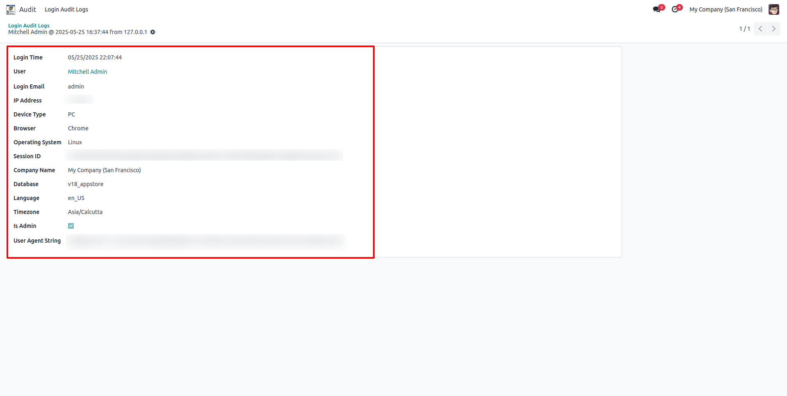

# 🔐 Login Audit Log – Track IP, Device, Session Info

> Developed by **Code Sparks** | 📧 info.codesparks@gmail.com | 🌐 [LinkedIn](https://www.linkedin.com/company/codesparks-tech)

---

## 📌 Overview

**Login Audit Log** is a powerful Odoo module that tracks every user login session and logs essential details such as:

- IP Address
- Device Type (PC, Mobile, Tablet)
- Browser & OS
- Session ID
- Login Time
- Language, Timezone, and Database Info
- Admin Access Status

---

## 🔍 Key Features

✅ Real-time logging of login sessions  
✅ Records IP, device, OS, browser, and session info  
✅ Tracks admin logins and company context  
✅ Integrated backend UI (tree and form views)  
✅ Easy to filter by user, IP, date, etc.  
✅ Smart `name` field for quick identification  
✅ Secure and optimized for performance

---

## 🖥️ Technical Details

| Attribute       | Value                     |
|----------------|---------------------------|
| Module Name     | `cs_login_audit_log`      |
| Version         | 18.0.0.0                  |
| Category        | Tools / Security          |
| Odoo Version    | 16.0, 17.0, 18.0          |
| License         | AGPL-3                    |
| Company         | Code Sparks               |
| Maintainer      | info.codesparks@gmail.com |

---

## 📸 Screenshots

### 🔧 Login Audit Tree View  


### 🧾 Login Audit Form View  


---

## 🚀 How It Works

Once a user logs in:

1. Their credentials are verified.
2. The module captures metadata (IP, device, OS, etc.).
3. A new record is saved in the `Login Audit Log`.
4. You can view/filter these logs in the backend menu:  
   `Audit > Login Audit Logs`

---

## 🧩 Dependencies

- Odoo base module
- Optional: `user-agents` Python package (parse user-agent strings)

```bash
pip install pyyaml user-agents
